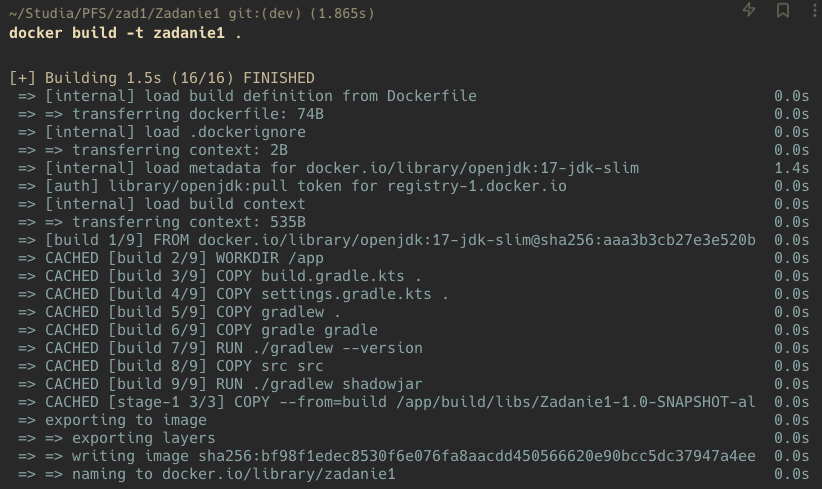
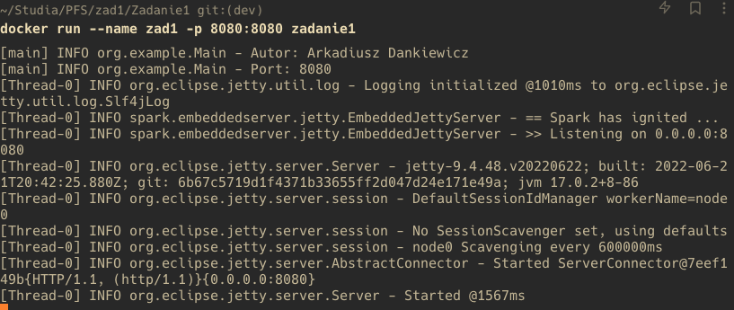
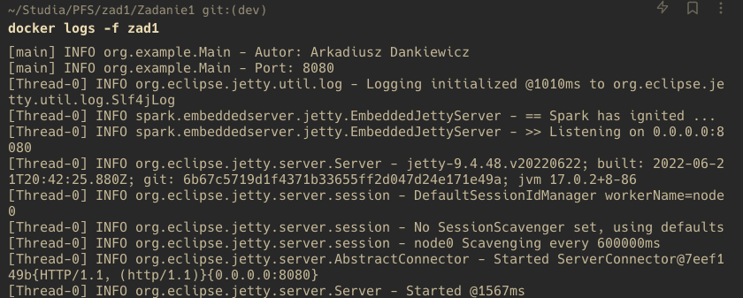
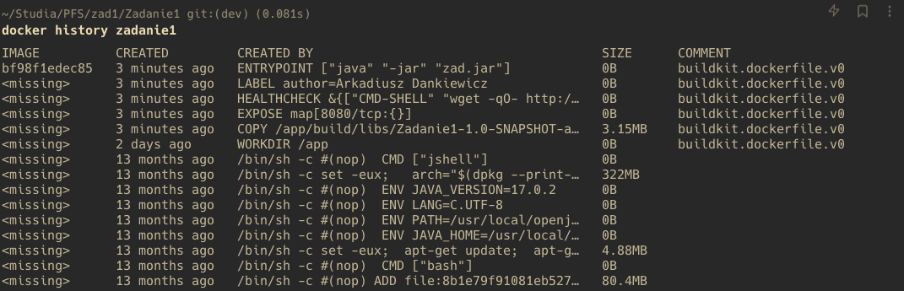

# Aplikacja dostępna pod linkiem: https://pfswcho-zadanie1.fly.dev/

# 1 (max. 20%) 
Proszę napisać program serwera (dowolny język programowania), który realizować będzie następującą funkcjonalność: 
- po uruchomieniu kontenera, serwer pozostawia w logach informację o dacie uruchomienia, imieniu i nazwisku autora serwera (imię i nazwisko studenta)  oraz porcie TCP, na którym serwer nasłuchuje na zgłoszenia klienta.  
- na podstawie adresu IP klienta łączącego się z serwerem, w przeglądarce powinna zostać wyświetlona strona informująca o adresie IP klienta i na podstawie tego adresu IP, o dacie i godzinie w jego strefie czasowej.
  
**[kod serwera Java](src/main/java/org/example/Main.java)** 

# 2. (max. 50%) 
Opracować plik Dockerfile, który pozwoli na zbudowanie obrazu kontenera realizującego funkcjonalność opisaną w punkcie 1. Przy ocenie brane będzie sposób opracowania tego pliku (wieloetapowe budowanie obrazu, ewentualne wykorzystanie warstwy scratch, optymalizacja pod kątem funkcjonowania cache-a w procesie budowania, optymalizacja pod kątem zawartości i ilości warstw, healthcheck itd ). Dockerfile powinien również zawierać informację o autorze tego pliku (ponownie imię oraz nazwisko studenta).
  
**[Dockerfile](Dockerfile)**

# 3. (max. 30%) 
Należy podać polecenia niezbędne do: 
- a. zbudowania opracowanego obrazu kontenera, 
  - `docker build -t zadanie1 .`
- b. uruchomienia kontenera na podstawie zbudowanego obrazu, 
  - `docker run --name zad1 -p 8080:8080 zadanie1`
- c. sposobu uzyskania informacji, które wygenerował serwer w trakcie uruchamiana kontenera (patrz: punkt 1a), 
  - `docker logs -f zad1`
- d. sprawdzenia, ile warstw posiada zbudowany obraz. 
  - `docker history zadanie1`

## Screenshots
- a. Rezultat build:
  - 
- b. Docker run
  - 
- c. Logs
  - 
- d. Warstwy
  - 