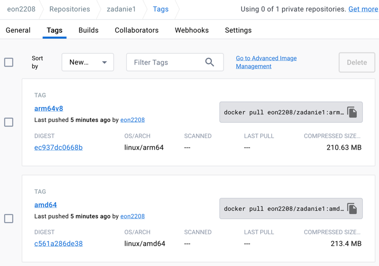

# 1 (max. 10%) 
Zbudować obrazy kontenera z aplikacją opracowaną w punkcie nr 1, które będą pracował na architekturach: linux/arm/v7, linux/arm64/v8 oraz linux/amd64 wykorzystując domyślnie skonfigurowany QEMU w Docker Desktop.
- 
- Niestety przy budowaniu obrazu dla arm/v7 otrzymywałem następujący błąd
  - 
  

# 2. (max. 20%) 
Zbudować obrazy kontenera z aplikacją opracowaną w punkcie nr 1, które będą pracował na architekturach: linux/arm/v7, linux/arm64/v8 oraz linux/amd64 wykorzystując sterownik dockercontainer.
- W tym celu możemy wykorzystac buildx przy pomocy następujących komend:
  - `docker buildx create --name builder`
  - `docker buildx use builder`
  - `docker buildx inspect --bootstrap`
- Następnie budujemy obraz na różne platformy:
  - linux/amd64
    - `docker buildx build --platform linux/amd64 -t zadanie1:amd .`
  - linux/arm/v7
    - `docker buildx build --platform linux/arm/v7 -t zadanie1:armv7 .`
  - linux/arm64/v8
    - `docker buildx build --platform linux/arm64/v8 -t zadanie1:armv64v8 .`
  

# 3. (max. 30%) 
Dockerfile powinien wykorzystywać rozszerzony frontend i umożliwiać wykorzystanie danych cache w procesie budowania obrazu (deklaracje wewnątrz Dockerfile).
- Deklaracja wykorzystania cache została wykonana za pomocą komend:
  - `--cache-to type=inline --cache-from type=inline`

# 4. (max. 40%)
i umożliwiać bezpośrednie wykorzystanie kodów aplikacji umieszczonych w swoim repozytorium publicznym na GitHub
- Aplikacja dostępna pod linkiem: https://pfswcho-zadanie1.fly.dev/ 

