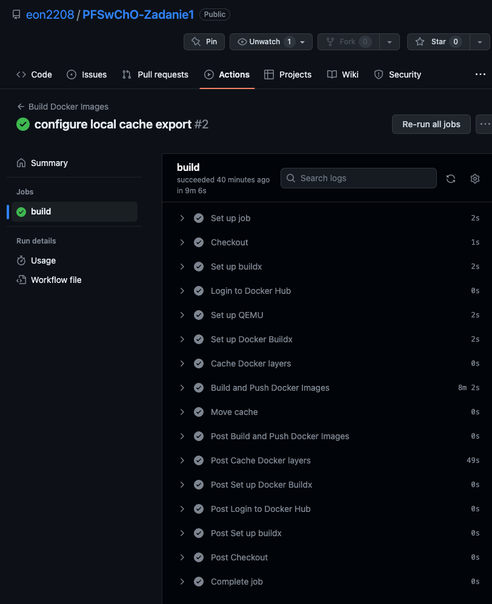
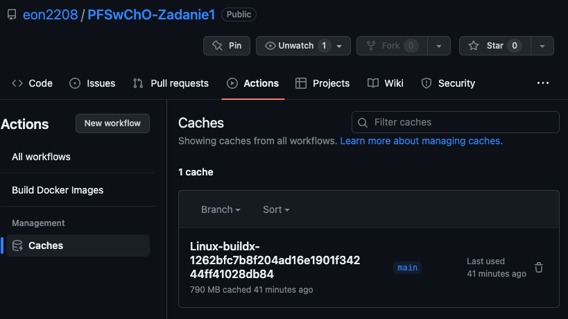
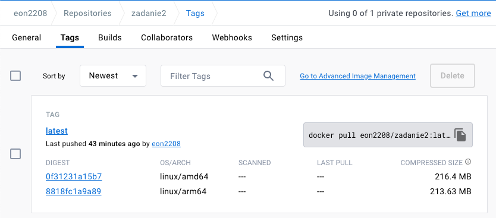

# 1 (max. 100%) 
Wykorzystując opracowaną aplikację (kod + Dockerfile) z zadania nr1 należy:  a. zbudować, uruchomić i potwierdzić poprawność działania łańcucha Github Actions, który zbuduje obrazy kontenera z tą aplikacją na architektury: linux/arm64/v8 oraz linux/amd64 wykorzystując QEMU
<br><br>

Plik github Actions odpowiedzialny za build: **[build.yaml](.github/workflows/build.yaml)** 

Akcja jest triggerowana za każdym razem gdy zostaje wykonana komenda push na branch *main*

```yaml
on:
  push:
    branches:
      - main
```

Widok Akcji github:


Informacje dotyczące cache:


Wyeksportowany obraz znajdujący się na docker hub zbudowany dla obu architektur: linux/arm64/v8 oraz linux/amd64:

